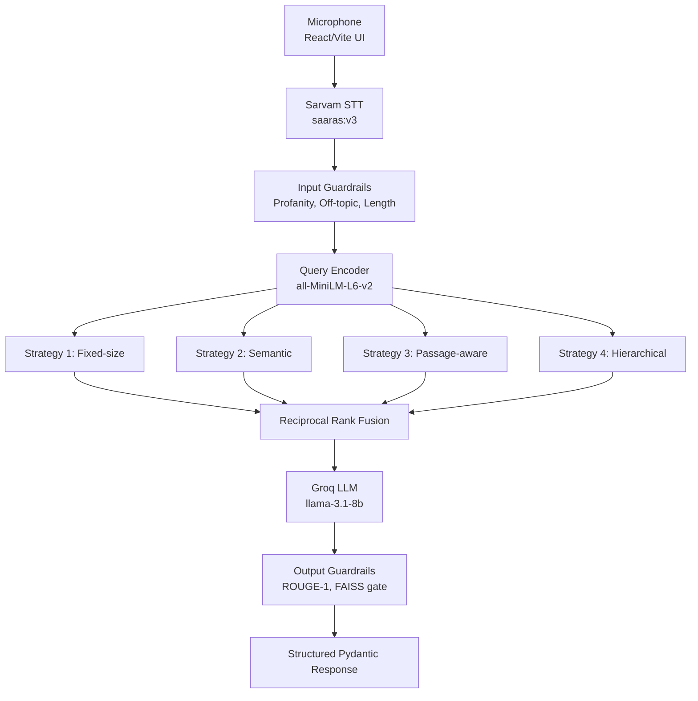
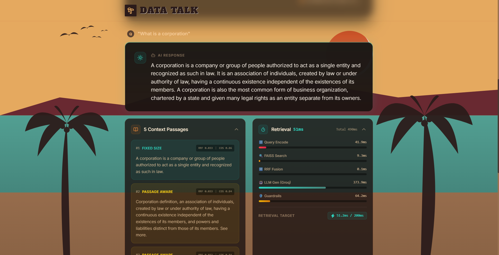

<div align="center">
  
  
  <h1>🌴 Data Talk - Voice RAG System 🌴</h1>
  <p><strong>HH Goa 2026 — Task 2</strong></p>
  
  <p>
    A high-performance, voice-enabled Retrieval-Augmented Generation pipeline built on the <b>ai4bharat/MSMARCO-XI</b> dataset. Features sub-second latency, multi-strategy retrieval, and aggressive hallucination guardrails.
  </p>

  <p>
    <code>Voice Input ➡️ Sarvam STT ➡️ Multi-Strategy Chunking/FAISS ➡️ RRF Fusion ➡️ LLM ➡️ Guardrailed Answer</code>
  </p>
</div>

---

## 🏗️ Architecture Flow



<div align="center">
  
  <br/>
  <i>Seamlessly handles voice queries and retrieves grounded context.</i>
</div>

---

## ✨ Core Features

### 🧩 Multi-Strategy Chunking
Four unique chunking strategies are run in parallel across separate FAISS partitions. Results are merged at query time using **Reciprocal Rank Fusion (RRF)**.
* **Fixed-size + overlap:** 256-token windows, 64-token overlap.
* **Semantic sentence:** NLTK sentence splitting, merged up to 192 tokens.
* **Passage-aware:** Uses `passages.English_passages` from the MSMARCO dataset.
* **Hierarchical:** Parent (full answer) + children (individual sentences).

### 🛡️ Iron-Clad Guardrails
* **Input Guardrails:** 
  * Profanity and unsafe content filter (`better_profanity`).
  * Off-topic detection using cosine similarity against a precomputed domain centroid.
  * Query length validation.
* **Output Guardrails:** 
  * ROUGE-1 recall grounding check (forces the LLM to cite the retrieved context).
  * FAISS confidence gate (rejects answers if the top retrieved doc is too dissimilar).
  * Hallucination heuristic (detects "I don't know" when context actually exists).

---

## ⚡ Performance & Benchmarks

<div align="center">
  
  <br/>
  <i>Built-in analytics for latency and retrieval targeting.</i>
</div>

| Subsystem | Target Latency |
| :--- | :--- |
| **Retrieval only** (encode + FAISS + RRF) | **< 200ms** 🚀 |
| **Text Pipeline** (Retrieval + LLM) | ~400–600ms |
| **Full Voice Pipeline** (STT + Text) | ~700–1400ms |

You can run your own benchmarks locally using the testing suite:
```bash
# Run P50/P70/P90/P100 latency benchmark (100 queries)
python tests/bench.py --n 100

# Full comprehensive test suite
pytest tests/test_pipeline_full.py -v
```

---

## 🚀 Quick Start

### 1. Install Dependencies
```bash
pip install -r requirements.txt
```

### 2. Configure API Keys
```bash
cp .env.example .env
# Open .env and add your Sarvam AI and Groq keys.
```

### 3. Build the Vector Index (One-Time)
This streams the MSMARCO-XI dataset, applies all 4 chunking strategies, embeds everything, and saves the FAISS indices locally.
```bash
python scripts/build_index.py
```

### 4. Run the API Server
```bash
uvicorn api.app:app --host 0.0.0.0 --port 8000
```
*Available Endpoints:* `POST /query`, `POST /voice-query`, `GET /health`

### 5. Run the React UI
Open a new terminal window:
```bash
cd frontend
npm install
npm run dev
```
Navigate to `http://localhost:3000` in your browser.

---

## 🛠️ Tech Stack

| Domain | Tools Used |
| :--- | :--- |
| **Frontend UI** | React, Vite, TailwindCSS, Lucide-React |
| **API Backend** | FastAPI, Uvicorn, Pydantic |
| **Speech-to-Text** | Sarvam AI (saaras:v3) |
| **LLM Generation** | Groq (`llama-3.1-8b-instant`) |
| **Vector DB** | FAISS CPU (IVFFlat + FlatIP) |
| **Embeddings** | `sentence-transformers` (`all-MiniLM-L6-v2`) |
| **Guardrails** | Custom heuristics, `better-profanity`, `rouge-score` |
| **Data pipeline** | HuggingFace `datasets` |
